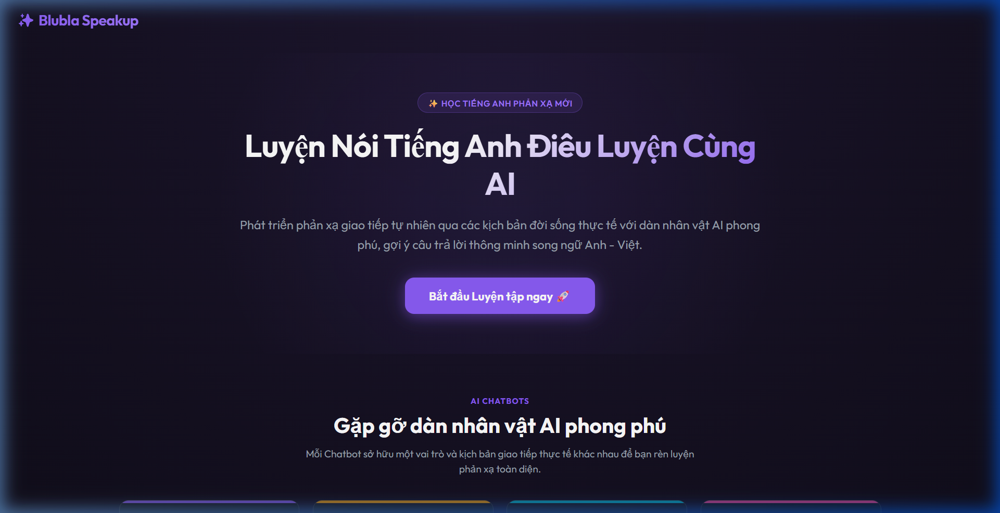
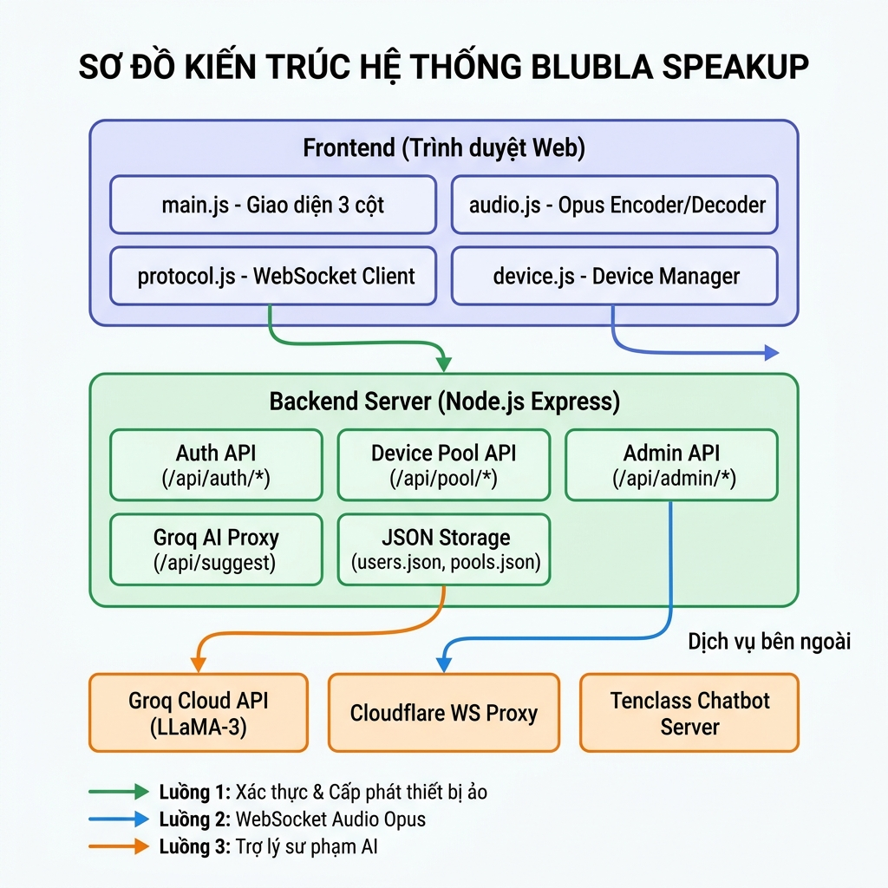
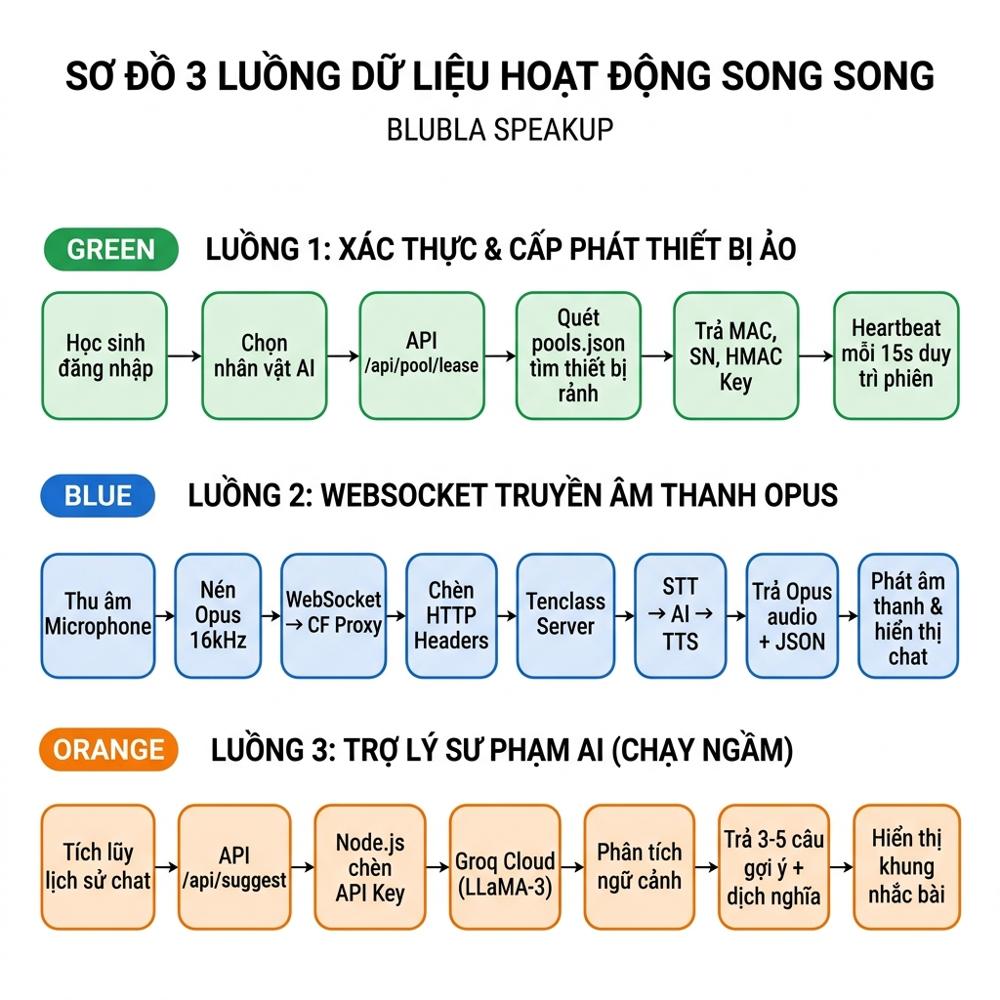
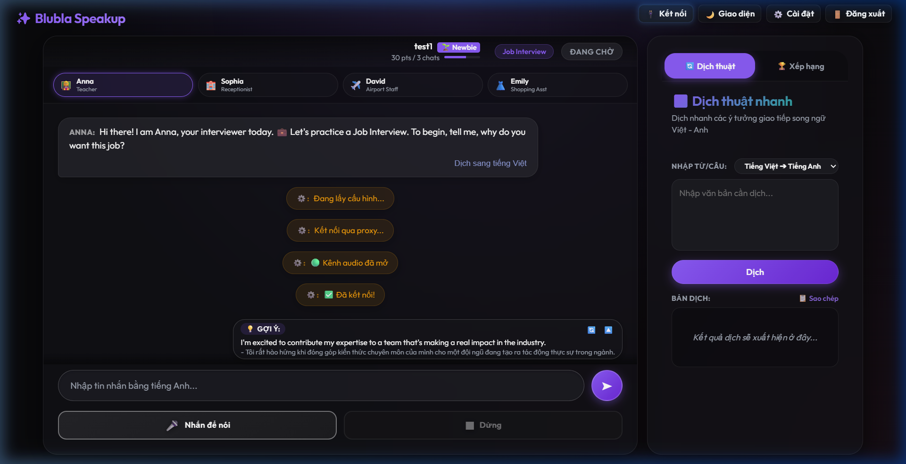
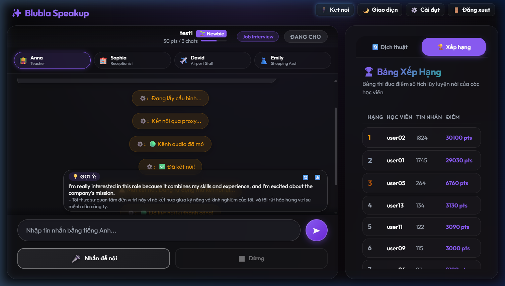
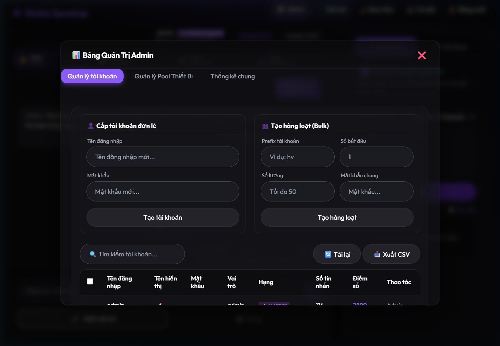
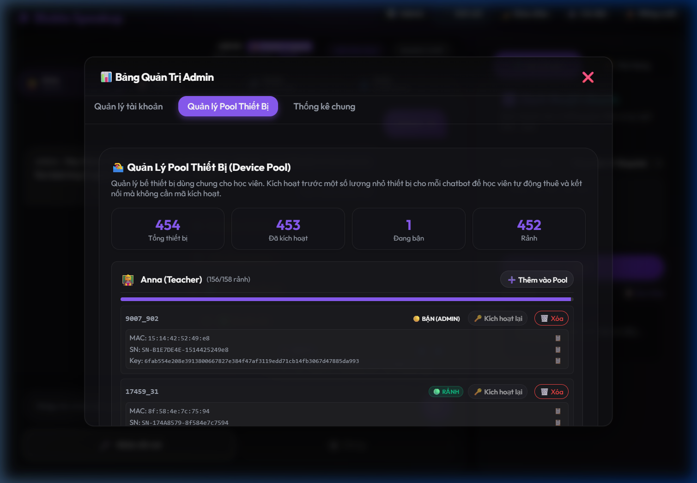

<div align="center">
  
  
  # 🎙️ BLUBLA SPEAKUP
  
  **Ứng dụng Web App AI Đa Trợ lý hỗ trợ rèn luyện phản xạ giao tiếp tiếng Anh dành cho học sinh THCS**
  
  [](https://nodejs.org/)
  [](https://expressjs.com/)
  [](https://workers.cloudflare.com/)
  [](https://groq.com/)
</div>

---

## 🌟 Giới thiệu tổng quan

**Blubla SpeakUp** là giải pháp phần mềm giáo dục đột phá, giúp học sinh THCS rèn luyện kỹ năng nghe - nói và phản xạ giao tiếp tiếng Anh thông qua việc đàm thoại trực tiếp với các "nhân vật AI bản xứ" ảo. 

Được tái cấu trúc và phát triển từ mã nguồn mở `py-xiaozhi`, nhóm tác giả đã áp dụng phương pháp **Vibe Coding** để nâng cấp toàn diện hệ thống từ một phần mềm yêu cầu cài đặt cục bộ và cấu hình phần cứng (ESP32) phức tạp thành một **Web App linh hoạt, chạy trực tiếp trên trình duyệt** (địa chỉ chính thức: [blublaspeakup.io.vn](https://blublaspeakup.io.vn)).

---

## 🚀 Tính năng nổi bật

- **🗣️ Đàm thoại Voice-to-Voice thời gian thực:** Giao tiếp bằng giọng nói tự nhiên, độ trễ thấp thông qua chuẩn nén âm thanh Opus và WebSocket.
- **🤖 Hệ sinh thái Persona đa dạng:** Cung cấp nhiều nhân vật AI đóng vai trò khác nhau (Giáo viên, Lễ tân, Nhân viên sân bay, Trợ lý mua sắm) để giả lập môi trường giao tiếp thực tế.
- **💡 Trợ lý Sư phạm Nhắc bài (Smart Hint):** Tự động phân tích bối cảnh và đưa ra 3-5 gợi ý câu trả lời tiếng Anh (kèm bản dịch) giúp học sinh không bao giờ bị "bí từ".
- **🏆 Gamification & Chấm điểm tự tin:** Cơ chế thi đua xếp hạng dựa trên sự dạn dĩ, số lượng tin nhắn trao đổi thay vì chấm lỗi ngữ pháp khắt khe.
- **☁️ Bể Thiết bị Ảo (Device Pool):** Cơ chế cấp phát tự động từ xa, người dùng không cần mua hay tự cài đặt bất kỳ thiết bị vật lý nào.

---

## 🏗️ Kiến trúc Hệ thống & Luồng Dữ liệu (Data Flow)

Blubla SpeakUp vận hành dựa trên sự kết hợp độc đáo của **02 luồng AI hoạt động song song**:

<div align="center">
  
  <br><i>Sơ đồ Kiến trúc Tổng thể Hệ thống</i>
</div>

<br>

<div align="center">
  
  <br><i>Sơ đồ 3 luồng dữ liệu hoạt động song song</i>
</div>

### 1️⃣ Luồng Xác thực & Bể Thiết bị ảo tự động (Device Pool API)
Khắc phục nhược điểm của phiên bản gốc yêu cầu cấu hình thủ công thiết bị phần cứng ESP32. Backend Node.js quản lý một `pools.json` gồm các "Thiết bị ảo". Khi học sinh chọn Chatbot, hệ thống gọi API `/api/pool/lease` để **thuê** thiết bị rảnh, tự động phân bổ MAC, Serial Number và mã bảo mật (HMAC) cho trình duyệt.

### 2️⃣ Luồng Đàm thoại (WebSocket Audio Flow)
Trình duyệt mã hóa âm thanh Micro sang Opus (16kHz), kết nối qua cầu nối **Cloudflare Worker Proxy** để qua mặt rào cản bảo mật của trình duyệt, chèn HTTP Header và truyền luồng nhị phân đến máy chủ **Tenclass**. Máy chủ phản hồi bằng giọng nói và tin nhắn văn bản JSON.

### 3️⃣ Luồng Trợ lý sư phạm phân tích ngầm (Pedagogical Stream)
Backend Node.js liên tục nhận lịch sử hội thoại từ giao diện Web, gửi ngầm lên **Groq Cloud API** (mô hình LLaMA-3) với tốc độ siêu tốc. Mô hình đóng vai trò giám khảo, dịch câu trước đó và đề xuất các mẫu câu trả lời phù hợp nhất.

---

## 🛠️ Hướng dẫn cài đặt & Triển khai (Dành cho Developer)

### 1. Yêu cầu hệ thống
- Node.js (phiên bản 16.x trở lên)
- NPM hoặc Yarn
- Tài khoản Cloudflare (để deploy Proxy)
- API Key Groq Cloud

### 2. Cài đặt Backend Node.js & Web App
```bash
# Clone kho lưu trữ
git clone https://github.com/your-username/blubla-speakup.git
cd blubla-speakup

# Cài đặt các thư viện phụ thuộc
npm install

# Cấu hình biến môi trường
cp .env.example .env
# Chỉnh sửa file .env với thông tin API Key và Port mong muốn

# Khởi chạy server
npm start
```
*Truy cập `http://localhost:3000` để xem ứng dụng.*

### 3. Cài đặt Cầu nối Cloudflare Proxy
Do trình duyệt không cho phép thay đổi header `Device-Id` trong WebSocket, hệ thống cần một Worker Proxy.
```bash
cd cloudflare-ws-proxy
npm install -g wrangler
wrangler login
wrangler deploy
```
*Sau khi deploy, cập nhật địa chỉ Worker URL vào `public/js/protocol.js`.*

---

## 📸 Giao diện ứng dụng

| Giao diện Học sinh (Khung 3 cột đàm thoại) | Bảng Xếp Hạng Thi Đua |
|:---:|:---:|
|  |  |
| **Giao diện Quản trị (Tài khoản)** | **Giao diện Quản trị (Device Pool)** |
|  |  |

---

## 📝 Cam kết bản quyền (License & Acknowledgement)

- Dự án này kế thừa cấu trúc giao tiếp giao thức lõi từ mã nguồn mở `py-xiaozhi` (Phát hành dưới Giấy phép MIT).
- **Đóng góp cải tiến cốt lõi của nhóm tác giả:**
  1. Chuyển đổi thành ứng dụng Web App đa nền tảng.
  2. Xây dựng cấu trúc phần mềm với 2 luồng AI hoạt động song song qua Groq API để chạy tính năng nhắc bài tự động.
  3. Quản trị và phân bổ thiết bị ảo (Virtual Device Pool API) từ xa, thay thế hoàn toàn phần cứng vật lý.
  4. Hệ thống Quản trị (Admin Dashboard), quản lý học sinh và bảng xếp hạng tự tin.

---
*Dự án tham gia cuộc thi phần mềm tin học và chuyển đổi số 2026. Phát triển bởi Nhóm Tác Giả Blubla SpeakUp.*
