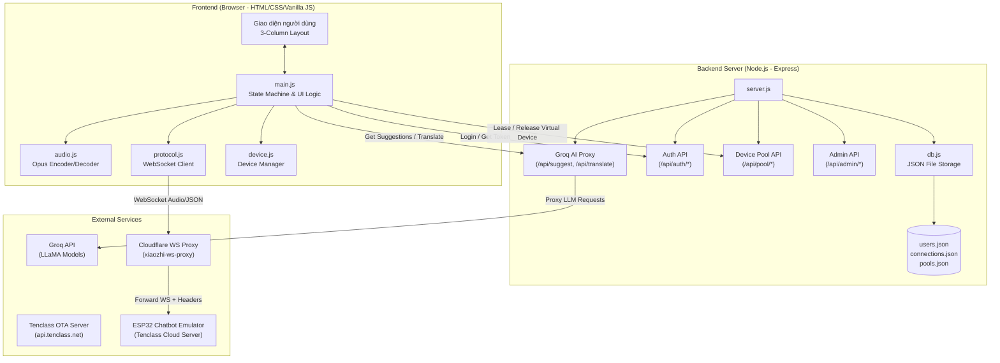

# TÀI LIỆU KIẾN TRÚC HỆ THỐNG VÀ LUỒNG HOẠT ĐỘNG (ARCHITECTURE & DATA FLOW)
## Dự án: BLUBLA SPEAKUP — Ứng dụng Chatbot đa trợ lý AI luyện giao tiếp phản xạ tiếng Anh dành cho học sinh THCS

Tài liệu này thuyết minh chi tiết kiến trúc kỹ thuật, mô hình tích hợp và luồng đi của dữ liệu trong hệ thống **BLUBLA SPEAKUP**, giải thích cách phần mềm tự động hóa kết nối thiết bị ảo (Virtual Device) thông qua cơ chế Bể thiết bị (Device Pool) và xử lý song song luồng học thuật.

---

## 1. Sơ đồ kiến trúc tổng thể (System Architecture Diagram)

Dưới đây là sơ đồ chi tiết biểu diễn mối liên hệ giữa các cấu phần thuộc Frontend (Trình duyệt học viên), Backend Server (Node.js) và các dịch vụ đám mây bên thứ ba:



---

## 2. Thuyết minh các cấu phần chính trong hệ thống

### 2.1. Cấu phần Frontend (Client-side)
Vận hành hoàn toàn trên trình duyệt web của người học (Chrome, Safari, Edge...), chịu trách nhiệm xử lý logic giao diện 3 cột và đóng vai trò như một **thiết bị ảo (Virtual Device)** giả lập phần cứng:
* **main.js (UI & State Machine):** Quản lý trạng thái đàm thoại (Chờ, Ghi âm, Trả lời, Lỗi), điều phối hành động của người dùng, cập nhật điểm số và bảng xếp hạng.
* **audio.js (Opus Encoder/Decoder):** Thu nhận âm thanh từ Micro bằng Web Audio API, nén âm thanh trực tiếp sang chuẩn nén chuyên dụng **Opus** ở tần số lấy mẫu **16kHz, đơn kênh (mono)** để tiết kiệm tối đa băng thông, đồng thời giải nén và phát luồng âm thanh Opus trả về từ máy chủ.
* **protocol.js (WebSocket Protocol):** Giả lập giao thức kết nối phần cứng, gửi gói tin bắt tay (hello), truyền dữ liệu nhị phân âm thanh và duy trì kết nối qua tín hiệu Heartbeat Ping/Pong định kỳ (mỗi 25 giây).
* **device.js (Device Manager):** Quản lý phiên thuê thiết bị ảo từ bể kết nối Node.js backend.

### 2.2. Cấu phần Backend (Node.js Server)
Đóng vai trò điều phối trung gian, bảo mật API Key và vận hành **Bể thiết bị ảo (Device Pool)** tự động hóa:
* **server.js & db.js:** Vận hành máy chủ web Express, thực hiện các nghiệp vụ backend.
* **Device Pool API (/api/pool/*):** Thực hiện cho thuê (`/api/pool/lease`), gia hạn (`/api/pool/heartbeat`) và giải phóng thiết bị ảo (`/api/pool/release`), lưu trữ trạng thái tại `pools.json`.
* **Groq AI Proxy API (/api/suggest, /api/translate):** Nhận lịch sử chat từ client, thay thế API Key bảo mật và gọi dịch vụ mô hình ngôn ngữ lớn (LLM) của Groq Cloud để sinh gợi ý đàm thoại, tránh lộ API Key phía client.

### 2.3. Cấu phần Dịch vụ bên ngoài (External Services)
* **Tenclass Chatbot Server (api.tenclass.net):** Xử lý trung tâm cho luồng đàm thoại tiếng Anh, nhận luồng Opus của thiết bị ảo, chuyển giọng nói thành văn bản (STT), gửi vào lõi AI đàm thoại và chuyển đổi phản hồi văn bản thành luồng giọng nói (TTS) gửi trả về.
* **Cloudflare Workers WS Proxy:** Đóng vai trò cầu nối. Trình duyệt web không cho phép tự chèn các Header HTTP tùy chỉnh (Device-Id, Client-Id, Authorization) vào bắt tay WebSocket trực tiếp. Proxy này nhận tham số kết nối từ query string của client và chuyển đổi thành HTTP Header hợp lệ trước khi gửi sang máy chủ Tenclass.
* **Groq Cloud API (LLaMA Models):** Dịch vụ trí tuệ nhân tạo hiệu năng cao thực hiện luồng phân tích sư phạm chạy ngầm.

---

## 3. Thuyết minh chi tiết 03 luồng dữ liệu hoạt động

Hệ thống **BLUBLA SPEAKUP** vận hành thông qua sự kết hợp của 03 luồng dữ liệu chạy song song, độc lập:

```
[Luồng 1] Học sinh đăng nhập -> Chọn Chatbot -> Server tự động cấp thiết bị ảo rảnh từ Pool
                             │
                             ▼ (Nhận MAC, SN, HMAC Key)
[Luồng 2] Ghi âm micro -> Nén Opus -> Gửi WebSocket qua CF Proxy -> Tenclass Server đàm thoại
                             │
                             ▼ (Cập nhật lịch sử hội thoại)
[Luồng 3] Lịch sử chat gửi ngầm -> Node.js Backend -> Groq API (LLaMA) -> Trả về gợi ý/dịch nghĩa
```

### Luồng 1: Xác thực & Cấp phát Thiết bị ảo tự động (Auth & Device Leasing Flow)
Giải quyết triệt để rào cản liên kết thiết bị thủ công phức tạp của hệ thống gốc:
1. Học sinh đăng nhập tài khoản học tập cá nhân qua Web App. Yêu cầu gửi tới API `/api/auth/login` kiểm tra cơ sở dữ liệu `users.json`.
2. Khi học sinh chọn một chatbot cụ thể (ví dụ: Sophia), Web App gửi yêu cầu thuê thiết bị ảo lên API `/api/pool/lease`.
3. Server Node.js quét danh sách thiết bị ảo đã được kích hoạt trước trong bể thiết bị ảo (`pools.json`).
4. Tìm kiếm thiết bị rảnh (thiết bị đã kích hoạt, chưa có ai thuê hoặc thời gian thuê trước đã quá thời hạn 5 phút timeout).
5. Thực hiện ghi nhận thiết bị đã được thuê bởi học sinh đó (`leased_to = username`, `leased_at = current_time`) và trả thông tin cấu hình (MAC, Serial Number, HMAC Key) về cho trình duyệt.
6. Trình duyệt bắt đầu đàm thoại và gửi nhịp tim (`/api/pool/heartbeat`) duy trì phiên thuê mỗi 15-20 giây.

### Luồng 2: WebSocket truyền âm thanh Opus (WebSocket Audio Flow - Luồng A)
Thực hiện giả lập tương tác đàm thoại trực tiếp thời gian thực:
1. Trình duyệt khởi tạo kết nối WebSocket đến Cloudflare Worker Proxy, truyền các tham số cấu hình thiết bị ảo đã thuê từ Luồng 1 dưới dạng Query Parameters.
2. Cloudflare Worker Proxy thực hiện bắt tay (handshake) với máy chủ Tenclass, tự động chuyển đổi các tham số thành các HTTP Header bắt buộc (`Device-Id`, `Client-Id`, `Authorization`).
3. Khi kết nối WebSocket được thiết lập thành công, trình duyệt gửi gói tin JSON bắt tay khai báo định dạng nén âm thanh `opus`, tần số `16000Hz`.
4. Khi học sinh bấm giữ nút nói, Web Audio API thu âm thanh từ micro, `audio.js` thực hiện mã hóa Opus thời gian thực và truyền các gói tin nhị phân qua kết nối WebSocket.
5. Máy chủ Tenclass nhận luồng âm thanh Opus, thực hiện chuyển đổi Voice-to-Text, xử lý tạo câu trả lời đàm thoại bằng AI, chuyển văn bản trả lời thành giọng nói tự nhiên rồi truyền luồng âm thanh Opus và thông điệp JSON tương ứng trở lại qua kết nối WebSocket.
6. Trình duyệt nhận dữ liệu nhị phân, giải nén Opus và phát phản hồi ra loa, đồng thời hiển thị hộp thoại tin nhắn của nhân vật AI ở cột giữa.

### Luồng 3: Trợ lý sư phạm phân tích ngầm (Pedagogical Groq Cloud Stream - Luồng B)
Đóng vai trò "phao cứu sinh" gợi ý đàm thoại thời gian thực cho học sinh:
1. Khi có bất kỳ tin nhắn thoại mới nào được hiển thị ở cột giữa đàm thoại, Web App ghi nhận lại toàn bộ lịch sử các lượt hội thoại trước đó.
2. Web App gửi ngầm (không chặn giao diện đàm thoại) mảng lịch sử trò chuyện này lên API `/api/suggest` của backend Node.js.
3. Server Node.js chèn API Key Groq bảo mật cùng System Prompt định hướng sư phạm (System Prompt yêu cầu AI đóng vai giáo viên hướng dẫn, phân tích ngữ cảnh và đề xuất 3-5 câu phản xạ tiếng Anh tự nhiên phù hợp nhất kèm nghĩa dịch tiếng Việt).
4. Groq API xử lý bằng mô hình ngôn ngữ lớn (LLaMA-3) cực nhanh và trả kết quả dạng JSON chứa các câu gợi ý về cho backend Node.js.
5. Backend Node.js chuyển tiếp dữ liệu về Web App. Giao diện người dùng lập tức hiển thị các câu gợi ý lên Khung nhắc bài của học sinh. Học sinh có thể nhấp chuột chọn để tham khảo cách trả lời hoặc gửi đi ngay lập tức.
