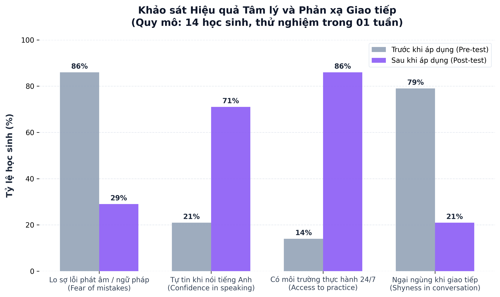
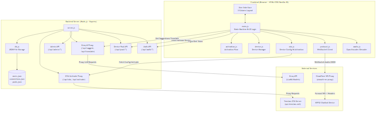

# BÁO CÁO THUYẾT MINH GIẢI PHÁP DỰ THI

## 1. TÊN GIẢI PHÁP DỰ THI
* **Tên chính thức:** **BLUBLA SPEAKUP** - Ứng dụng Chatbot đa trợ lý AI hỗ trợ rèn luyện phản xạ giao tiếp tiếng Anh dành cho học sinh THCS.
* **Lĩnh vực đăng ký dự thi:** Phần mềm tin học và chuyển đổi số.

---

## 2. MỤC ĐÍCH CỦA GIẢI PHÁP
Hiện nay, nhiều học sinh gặp khó khăn khi rèn luyện kỹ năng giao tiếp tiếng Anh. Rào cản lớn nhất chính là tâm lý sợ sai, sợ bị chê cười về phát âm hay ngữ pháp, khiến các bạn học sinh trở nên e dè và ngại mở lời. Bên cạnh đó, sĩ số lớp học thường rất đông, giáo viên khó có đủ thời gian để hướng dẫn thực hành cho từng cá nhân trong tiết học ngắn. Hơn nữa, chi phí tại các trung tâm ngoại ngữ hiện nay còn khá cao. Điều này vô tình tạo ra khoảng cách trong việc tiếp cận giáo dục chất lượng, đặc biệt với các bạn học sinh tại những vùng còn nhiều khó khăn trên địa bàn tỉnh Lâm Đồng.

Từ những phân tích thực trạng nêu trên, nhóm tác giả xây dựng ứng dụng **Blubla SpeakUp** nhằm hướng tới các mục tiêu chiến lược sau:
1. **Giảm áp lực tâm lý:** Blubla SpeakUp tạo ra một không gian giao tiếp riêng tư với AI. Tại đây, người học có thể thoải mái thực hành mà không lo sợ bị đánh giá hay chấm điểm. Điều này giúp học sinh tự tin hơn và dần yêu thích việc nói tiếng Anh.
2. **Rèn luyện phản xạ mọi lúc:** Với khả năng tương tác giọng nói 24/7, ứng dụng mô phỏng các tình huống thực tế để người học luyện tập thường xuyên. Từ đó, thói quen giao tiếp tiếng Anh được hình thành một cách tự nhiên.
3. **Tiếp cận công nghệ dễ dàng:** Nhóm tác giả tận dụng sức mạnh của các dịch vụ AI miễn phí để tạo ra một công cụ luyện nghe - nói dễ tiếp cận cho học sinh có điều kiện khó khăn. Qua đó, học sinh dù ở đâu cũng có cơ hội tiếp cận phương pháp học tập hiện đại và chất lượng cao.

---

## 3. MÔ TẢ GIẢI PHÁP

### 3.1. Bản chất của giải pháp
Xuất phát từ thực trạng học sinh THCS thường có rào cản tâm lý "sợ sai, ngại giao tiếp" khi thực hành ngoại ngữ, nhóm tác giả đã nghiên cứu và phát triển nền tảng **BLUBLA SPEAKUP**. Đây là một ứng dụng nền web (Web App) được tích hợp công nghệ Trí tuệ nhân tạo Đa trợ lý. Bản chất của giải pháp là tạo ra một môi trường đàm thoại Anh ngữ giả lập an toàn, cho phép người học tương tác trực tiếp với các "nhân vật ảo bản xứ" qua cả giọng nói và văn bản, từ đó thúc đẩy phản xạ ngôn ngữ tự nhiên.

### 3.2. Cấu trúc và cơ chế hoạt động kỹ thuật
Giải pháp được nhóm tác giả kế thừa và phát triển từ mã nguồn mở `py-xiaozhi` (ngôn ngữ lập trình Python). Thông qua phương pháp lập trình có sự hỗ trợ của AI (Vibe Coding), nhóm tác giả đã tái cấu trúc toàn diện, nâng cấp hệ thống từ một phần mềm yêu cầu cài đặt cục bộ trên máy tính thành một Web App linh hoạt, có thể dùng trực tiếp trên trình duyệt ở nhiều loại thiết bị (máy tính, điện thoại, máy tính bảng) thông qua địa chỉ chính thức **blublaspeakup.io.vn**.

Điểm đột phá về mặt kiến trúc phần mềm là việc thiết kế **02 luồng AI hoạt động song song**, tối ưu hóa hoàn toàn từ các tài nguyên AI miễn phí:
* **Luồng đàm thoại (Stream A):** Sử dụng API từ máy chủ Tenclass (Xiaozhi.me). Luồng này đảm nhiệm vai trò "nhập vai" nhân vật, xử lý ngôn ngữ tự nhiên, lắng nghe giọng nói của học sinh và phản hồi bằng âm thanh kết hợp cùng hộp thoại tin nhắn hiển thị trực tiếp.
* **Luồng trợ lý sư phạm (Stream B):** Tích hợp API Groq Cloud với các mô hình ngôn ngữ lớn hiệu năng cao (như LLaMA-3). Luồng này chạy ngầm độc lập, đóng vai trò như một bộ vi xử lý giám sát, liên tục phân tích bối cảnh hội thoại để thực hiện nhiệm vụ dịch thuật và trích xuất câu gợi ý giao tiếp, nhắc bài cho học sinh theo thời gian thực.

### 3.3. Các tính năng cốt lõi
* **Đa dạng hóa nhân vật đàm thoại (Persona Ecosystem):** Hệ thống không giới hạn ở một trợ lý đơn điệu mà tích hợp hệ sinh thái nhiều AI mang tính cách và chức danh khác nhau (Cô giáo Anna dạy phỏng vấn, Lễ tân Sophia khách sạn, Nhân viên sân bay David, Trợ lý mua sắm Emily...). Cơ chế này đặt người học vào các mô hình giao tiếp theo tình huống bám sát thực tiễn.
* **Cơ chế nhắc bài thông minh (Smart Hint System):** Trong suốt quá trình giao tiếp, hệ thống (thông qua Luồng B) sẽ liên tục nắm bắt toàn bộ ngữ cảnh của các lượt hội thoại trước đó. Dựa trên nguồn dữ liệu này, AI sẽ tự động tổng hợp và đề xuất sẵn các mẫu câu trả lời khả thi, đồng thời cung cấp công cụ dịch thuật hai chiều. Chức năng "nhắc bài" này luôn ở trạng thái sẵn sàng để người học tham khảo bất cứ lúc nào, giúp bảo vệ mạch đàm thoại không bị đứt gãy và duy trì động lực học tập.
* **Trò chơi hóa dựa trên việc thúc đẩy sự tự tin:** Đi ngược lại với phương pháp chấm điểm truyền thống, chỉ tập trung vào độ chính xác tuyệt đối của ngữ pháp hay phát âm, thuật toán của **BLUBLA SPEAKUP** ưu tiên cộng điểm dựa trên sự dạn dĩ và tần suất chủ động giao tiếp (số lượng tin nhắn thoại trao đổi).

### 3.4. Khắc phục nhược điểm của các giải pháp đã biết
Dựa trên quá trình nghiên cứu và thử nghiệm thực tiễn, nhóm tác giả đã nhận diện và khắc phục thành công những hạn chế của các nền tảng Chatbot AI và các ứng dụng học giao tiếp anh ngữ khác. Dưới đây là bảng tổng hợp các điểm cải tiến của BLUBLA SPEAKUP:

| Tiêu chí | Mã nguồn gốc (py-xiaozhi) | Các phần mềm học tiếng Anh khác | GIẢI PHÁP BLUBLA SPEAKUP |
| :--- | :--- | :--- | :--- |
| **Nền tảng vận hành** | Yêu cầu cài đặt phức tạp trên máy tính cá nhân. | Ứng dụng điện thoại hoặc Web độc quyền, đóng kín. | **Web App tiện lợi**, không yêu cầu cài đặt, truy cập đa nền tảng (PC, Điện thoại, Máy tính bảng). |
| **Kiến trúc AI** | Vận hành 01 luồng AI đơn nhiệm. | Chủ yếu sử dụng kịch bản (Script) hội thoại lập trình sẵn tĩnh. | **Vận hành song song 02 luồng AI**: Đàm thoại thực tế và Phân tích hỗ trợ sư phạm (nhắc bài). |
| **Môi trường đàm thoại** | Cung cấp 01 nhân vật trợ lý duy nhất. | Người học phải tuân thủ các đoạn hội thoại có tính rập khuôn. | **Tích hợp hệ sinh thái Persona đa dạng** (Giáo viên, Lễ tân, Nhân viên bán hàng...). Hỗ trợ hội thoại mở tự do theo ý người học. |
| **Triết lý đánh giá** | Không tích hợp công cụ đánh giá. | Sửa lỗi ngữ pháp, phát âm khắt khe (dễ tạo áp lực tâm lý cho học sinh). | **Ghi nhận và chấm điểm sự tự tin** qua số lượt chat, tạo môi trường học tập an toàn, khuyến khích sự chủ động. |
| **Chi phí sử dụng** | Miễn phí (yêu cầu phần cứng cao). | Thường có phí bản quyền khá đắt. | **Hoàn toàn miễn phí** cho học sinh thông qua tối ưu hóa API Cloud miễn phí. |

---

## 4. TÍNH MỚI, TÍNH SÁNG TẠO

### 4.1. Tính mới về mặt công nghệ
* **Ứng dụng "Vibe Coding" để vượt qua giới hạn kỹ thuật:** Là học sinh Trung học Cơ sở, nhóm tác giả tự nhận thấy bản thân còn nhiều giới hạn về kỹ năng viết mã code chuyên sâu. Tuy nhiên, thay vì để rào cản kỹ thuật cản bước ý tưởng, nhóm tác giả đã áp dụng phương pháp "Vibe Coding". Nhóm tác giả tập trung vào tư duy giải quyết vấn đề, định hình rõ ý tưởng và chức năng muốn có, sau đó sử dụng AI như một trợ lý đắc lực để đọc hiểu, tinh chỉnh và kết nối mã nguồn mở. Cách tiếp cận sáng tạo này giúp nhóm tác giả triển khai thành công một ứng dụng Web thực tế từ những ý tưởng ban đầu, biến một phần mềm máy tính phức tạp thành công cụ học tập tiện lợi trên mọi trình duyệt.
* **Cơ chế hai luồng AI hoạt động song song:** Các ứng dụng học tập thông thường đa phần chỉ sử dụng một hệ thống AI xử lý tập trung. Điểm sáng tạo của BLUBLA SPEAKUP là phân chia công việc cho hai AI hoạt động đồng thời. Luồng AI thứ nhất (dựa trên API Tenclass) chuyên đóng vai nhân vật để đàm thoại và phát âm. Luồng AI thứ hai (dựa trên API Groq Cloud) âm thầm chạy phía sau làm nhiệm vụ phân tích ngữ cảnh, dịch thuật và gợi ý câu. Bằng cách kết nối thông minh hai luồng API hoàn toàn miễn phí, nhóm tác giả đã xây dựng được một hệ thống xử lý phức tạp, mượt mà nhưng lại tối ưu hóa được chi phí vận hành.
* **Cấu hình tự động kết nối từ xa qua Device Pool:** Điểm sáng tạo đột phá ở backend là việc xây dựng hệ quản trị **Bể thiết bị ảo (Device Pool)**. Hệ thống đã loại bỏ hoàn toàn rào cản kỹ thuật của phiên bản gốc (bắt buộc người dùng phải tự đăng ký thiết bị vật lý thủ công trên xiaozhi.me) bằng cách tự động hóa quy trình thuê và đồng bộ kết nối ảo từ xa. Học sinh chỉ cần đăng nhập và chọn nhân vật là có thể đàm thoại ngay lập tức.

### 4.2. Tính sáng tạo trong trải nghiệm học tập
Sản phẩm được thiết kế từ chính góc nhìn thực tế của học sinh nhằm giải quyết triệt để rào cản tâm lý "sợ sai" khi giao tiếp ngoại ngữ:
* **Đổi mới cách chấm điểm để xóa bỏ nỗi sợ:** Rất nhiều ứng dụng tiếng Anh hiện nay tập trung soi xét và "bắt lỗi" từng điểm ngữ pháp, phát âm, khiến học sinh cảm thấy áp lực. BLUBLA SPEAKUP sáng tạo ra cơ chế thi đua tập trung vinh danh sự tự tin. Hệ thống ưu tiên cộng điểm cho sự dạn dĩ, tốc độ duy trì hội thoại và tần suất chủ động giao tiếp của người dùng. Cách đánh giá này tạo ra một môi trường an toàn, cổ vũ tinh thần học hỏi thay vì phán xét.
* **Tính năng nhắc bài tự động:** Khi đàm thoại bằng tiếng Anh, học sinh rất dễ bị "bí" từ, dẫn đến việc ngập ngừng và bỏ cuộc. Nhận thấy điều đó, nhóm tác giả đã sáng tạo ra một "phao cứu sinh" thầm lặng. Bằng việc tận dụng luồng AI thứ hai để liên tục theo dõi toàn bộ nội dung cuộc trò chuyện trước đó, hệ thống luôn tự động tổng hợp và chuẩn bị sẵn các mẫu câu trả lời gợi ý cùng công cụ dịch nghĩa hai chiều. Khi gặp khó khăn, học sinh có thể tham khảo ngay các gợi ý này, giúp mạch giao tiếp tiếp tục diễn ra tự nhiên mà không bị đứt đoạn.
* **Thực hành giao tiếp qua nhập vai:** Điểm sáng tạo tiếp theo là việc đưa học sinh vào các bối cảnh giao tiếp sát thực tế. Hệ thống không chỉ cung cấp một AI trò chuyện chung chung mà mang đến một loạt các "nhân vật ảo" với nghề nghiệp rõ ràng (nhân viên sân bay, tiếp tân khách sạn, thu ngân...). Nhờ đó, người học được tự do lựa chọn tình huống, tạo cảm giác sinh động và thú vị hơn rất nhiều so với việc chỉ đọc thuộc các đoạn hội thoại in sẵn trong sách giáo khoa.

---

## 5. NỘI DUNG THỰC HIỆN

### 5.1. Quá trình phát triển và cách thức xây dựng ứng dụng
* **Giai đoạn 1: Khảo sát thực trạng và định hình giải pháp.** Nhóm tác giả đã tiến hành khảo sát trên quy mô 400 học sinh tại trường để tìm hiểu khó khăn trong việc học tiếng Anh. Kết quả thu về cho thấy kỹ năng nghe, nói và phản xạ đàm thoại là rào cản lớn nhất. Từ vấn đề này, nhóm tác giả quyết định xây dựng một môi trường đàm thoại ảo và lựa chọn kế thừa mã nguồn mở `py-xiaozhi` làm nền tảng phát triển ban đầu.  
* **Giai đoạn 2: Lập trình ứng dụng và xử lý sự cố kỹ thuật với sự hỗ trợ của AI.** Để chuyển đổi mã nguồn cục bộ thành ứng dụng Web và tích hợp hệ thống 02 luồng AI (Tenclass và Groq Cloud), nhóm tác giả đã lập trình dưới sự hỗ trợ của AI thông qua môi trường Antigravity. Ở những phiên bản đầu tiên, nhóm tác giả đã gặp không ít sự cố kỹ thuật: AI không thể phát âm, hệ thống âm thanh bị rè, hoặc cuộc trò chuyện tự động ngắt kết nối chỉ sau vài câu đàm thoại. Thay vì bỏ cuộc, nhóm tác giả đã thu thập lịch sử lỗi và dùng chính AI để cùng phân tích nguyên nhân, từng bước tinh chỉnh các dòng lệnh cho đến khi ứng dụng chạy trơn tru.  
* **Giai đoạn 3: Tinh chỉnh và hoàn thiện giao diện.** Khi kiến trúc phần mềm đã ổn định, nhóm tác giả tập trung viết các câu lệnh hệ thống để tạo tính cách cho các nhân vật đàm thoại và xây dựng thuật toán cho hệ thống thi đua nhằm đánh giá sự tự tin của người dùng.

### 5.2. Thời gian và kết quả thử nghiệm thực tế
Để có cơ sở thực tiễn đánh giá tính khả thi và hiệu quả của giải pháp, nhóm tác giả đã tiến hành chạy thử nghiệm ứng dụng: 
* **Quy mô và thời gian:** Sản phẩm được đưa vào thử nghiệm thực tế với 14 học sinh trong thời gian liên tục 01 tuần.
* **Phương pháp đo lường:** Nhóm tác giả thực hiện đánh giá năng lực và tâm lý thông qua 02 bài khảo sát trước và sau khi sử dụng.
* **Kết quả thu nhận:** Qua một tuần thử nghiệm, có khoảng 40% học sinh duy trì việc tương tác đều đặn với ứng dụng và hoàn thành trọn vẹn lộ trình. Dữ liệu đối chiếu từ nhóm học sinh này cho thấy những cải thiện đáng kể về mặt tâm lý và phản xạ ngôn ngữ. Học sinh phản hồi cảm thấy dạn dĩ hơn, giảm bớt áp lực "sợ sai" nhờ môi trường đàm thoại ảo an toàn và sự hỗ trợ từ tính năng gợi ý. Tỷ lệ chuyển biến thực tế này đã cung cấp cho nhóm tác giả nguồn dữ liệu khách quan quan trọng để tiếp tục tinh chỉnh cơ chế thi đua, nhằm tăng sức hút và giữ chân người học tốt hơn trong các phiên bản sau.

---

## 6. HƯỚNG DẪN SỬ DỤNG, VẬN HÀNH MÔ HÌNH, SẢN PHẨM

### 6.1. Quy trình sử dụng và học tập dành cho Học sinh:
1. Truy cập liên kết ứng dụng tại địa chỉ chính thức: **blublaspeakup.io.vn** trên trình duyệt web bằng bất kỳ thiết bị thông minh nào.
2. Đăng nhập hệ thống bằng tài khoản cá nhân được giáo viên cấp (ví dụ tài khoản học tập thử nghiệm: `test1` / mật khẩu: `test123`).
3. Tại giao diện chính, chọn nhân vật AI phù hợp với mục tiêu luyện tập (ví dụ: Cô giáo Anna, Lễ tân Sophia...).
4. Sử dụng tính năng thu âm trực tiếp (Voice) để đàm thoại với AI. Nhấn giữ hoặc bấm nút **🎤 Nhấn để nói** để nói tiếng Anh, nhả nút để gửi âm thanh đi.
5. Quan sát khung hỗ trợ thông minh ở cột bên phải hoặc phía trên ô nhập liệu để nhận các gợi ý câu thoại và bản dịch trong thời gian thực khi cần thiết.
6. Theo dõi tiến trình học tập, tích lũy điểm số sự tự tin và bảng xếp hạng thi đua ở cột phải.

### 6.2. Quy trình vận hành và kiểm tra dành cho Giáo viên / Ban Giám Khảo:
* **Đường dẫn trải nghiệm:** [https://blublaspeakup.io.vn](https://blublaspeakup.io.vn)
* **Tài khoản quản trị (Admin):** `admin`
* **Mật khẩu:** `admin123`

Sau khi đăng nhập tài khoản quản trị, Ban giám khảo nhấp vào biểu tượng **📊 Admin** ở thanh công cụ phía trên bên phải màn hình để truy cập Bảng quản trị tập trung:
* **Quản lý tài khoản:** Xem danh sách, tạo đơn lẻ hoặc tạo hàng loạt tài khoản học sinh nhanh chóng bằng Prefix, đổi mật khẩu chung, xóa tài khoản, hoặc xuất tệp CSV dữ liệu điểm.
* **Quản lý Pool thiết bị:** Quản lý danh sách kết nối thiết bị ảo đàm thoại, theo dõi chỉ số bận/rảnh theo thời gian thực và kích hoạt thêm tài nguyên kết nối.
* **Thống kê chung:** Giám sát tổng điểm toàn lớp, xem biểu đồ phân bố thứ hạng và danh sách học viên tiêu biểu.

### 6.3. Cơ chế tự động hóa liên kết thiết bị ảo thay thế phần cứng vật lý
Nhận thấy việc yêu cầu mỗi học sinh phải trang bị một thiết bị phần cứng ESP32 vật lý là không khả thi và gây rào cản lắp đặt, nhóm tác giả đã phần mềm hóa thiết bị vật lý thành thiết bị ảo (Virtual Device) chạy trực tiếp trên trình duyệt của người dùng:
1. **Giả lập luồng âm thanh Opus:** Trình duyệt Web tự động làm nhiệm vụ thu nhận âm thanh từ micro, nén trực tiếp sang codec nén Opus (16kHz) và đẩy nhị phân qua WebSocket, giả lập hoàn hảo phần cứng vật lý.
2. **Cơ chế cấp phát tự động (Device Pool API):** Thay vì bắt buộc học sinh phải đăng nhập vào xiaozhi.me để nhập mã kích hoạt thiết bị thủ công, backend Node.js của Blubla SpeakUp tự động kết nối và quản lý bể kết nối. Khi học sinh bấm chọn chatbot, API `/api/pool/lease` sẽ tự động tìm kiếm một thiết bị ảo đang rảnh trong tệp `pools.json`, cập nhật thông tin cho thuê (`leased_to = username`, thời gian thuê duy trì 5 phút qua Heartbeat) và gửi cấu hình (MAC, SN, HMAC Key) về cho trình duyệt thiết lập bắt tay.
3. **Cổng Proxy Cloudflare Worker:** Khắc phục nhược điểm trình duyệt không cho chèn Header HTTP tùy chỉnh (Device-Id, Client-Id) vào WebSocket handshake. Trình duyệt sẽ kết nối WebSocket đến Cloudflare Worker Proxy để chèn các Header bảo mật cần thiết trước khi kết nối trực tiếp đến máy chủ đàm thoại Tenclass.

---

## 7. KHẢ NĂNG ÁP DỤNG VÀO THỰC TIỄN
Giải pháp đã chứng minh khả năng áp dụng linh hoạt trong môi trường học tập tại trường học và quá trình tự rèn luyện tại nhà. Kết quả kiểm chứng thực tiễn được ghi nhận cụ thể qua ba giai đoạn:

### 7.1. Trước khi áp dụng (Pre-test)
Kết quả khảo sát đầu vào đối với 14 học sinh cho thấy phần lớn các bạn đều gặp khó khăn lớn trong việc nghe - nói. Trở ngại chính là tâm lý e ngại, sợ phát âm sai, sợ vi phạm ngữ pháp và hoàn toàn thiếu một môi trường an toàn để thực hành đàm thoại hàng ngày.

### 7.2. Trong và Sau khi áp dụng (Post-test)
Ứng dụng ghi nhận mức độ tương tác thực tế khá khả quan. Trong số 14 học sinh tham gia, có khoảng 40% (tương đương 5-6 bạn) đã hình thành và duy trì thói quen truy cập, đàm thoại đều đặn với AI trong suốt tuần. Dữ liệu khảo sát đầu ra cho thấy sự cải thiện rõ rệt, đặc biệt ở nhóm học sinh duy trì sử dụng thường xuyên. Học sinh phản hồi đã giảm bớt đáng kể áp lực "sợ sai" và cảm thấy dạn dĩ hơn khi mở lời.

Dưới đây là biểu đồ trực quan thể hiện sự cải thiện rõ rệt các chỉ số tâm lý và thực hành trước và sau khi sử dụng giải pháp:

### 7.3. Minh họa Bảng xếp hạng Thi đua (Leaderboard)
Học sinh tích cực tham gia luyện nói sẽ được cộng điểm thi đua tự động. Bảng xếp hạng vinh danh các bạn có số lượng tin nhắn đàm thoại nhiều nhất, tạo động lực cạnh tranh học tập lành mạnh:

| Thứ hạng | Tên hiển thị | Tên tài khoản | Số tin nhắn thoại | Điểm số (Sự tự tin) | Cấp độ (Rank) |
| :---: | :--- | :---: | :---: | :---: | :---: |
| 🥇 Hạng 1 | Nguyễn Minh Triết | test1 | 45 | 450 | Platinum |
| 🥈 Hạng 2 | Trần Thảo Vy | test2 | 32 | 320 | Gold |
| 🥉 Hạng 3 | Lê Tuấn Anh | test3 | 25 | 250 | Gold |
| 4 | Admin User | admin | 1 | 10 | Newbie |

### 7.4. Tính an toàn và bảo vệ sức khỏe
Bên cạnh giá trị giáo dục, giải pháp còn đáp ứng tốt tiêu chí an toàn khi áp dụng vào đời sống. Khác với các ứng dụng bắt người dùng phải liên tục đọc và gõ văn bản, việc tương tác chủ yếu qua giọng nói (Voice) giúp học sinh hạn chế thời gian dán mắt vào màn hình, qua đó góp phần bảo vệ thị lực khi học tập.

---

## 8. GIÁ TRỊ MANG LẠI CỦA GIẢI PHÁP

### 8.1. Giá trị về Kinh tế
* Việc kết hợp khéo léo mã nguồn mở cùng các nền tảng API cung cấp mô hình ngôn ngữ lớn miễn phí (Tenclass và Groq Cloud) giúp kiến tạo một ứng dụng học tập tiếng Anh với chi phí vận hành gần như bằng không.
* Dưới góc độ người học, định dạng ứng dụng nền Web giúp tiết kiệm hoàn toàn chi phí mua sắm thiết bị cấu hình cao hay chi trả cho các phần mềm bản quyền đắt đỏ. Học sinh chỉ cần một thiết bị có kết nối internet cơ bản là đã có thể tiếp cận môi trường học tập chất lượng cao.

### 8.2. Giá trị về Kỹ thuật
* Giải pháp minh chứng cho khả năng hoạt động ổn định của hệ sinh thái tích hợp hai luồng AI chạy song song, xử lý mượt mà cùng lúc tác vụ nhận diện/phản hồi giọng nói và tác vụ phân tích, gợi ý/dịch thuật chạy ngầm.
* Sự thành công của dự án thông qua phương pháp lập trình có sự hỗ trợ của AI (Vibe Coding) là minh chứng cho việc học sinh hoàn toàn có thể sử dụng AI như một trợ lý lập trình đắc lực để vượt qua giới hạn kỹ thuật bản thân, tự tay hiện thực hóa ý tưởng phần mềm vào thực tiễn.

### 8.3. Giá trị về Xã hội và Giáo dục
* Với cơ chế thi đua dựa trên thúc đẩy sự tự tin thay vị bắt lỗi, ứng dụng mang lại giá trị to lớn về mặt tinh thần, giúp học sinh Trung học Cơ sở cởi bỏ tâm lý "sợ sai, ngại nói", dần hình thành sự chủ động trong đàm thoại ngoại ngữ.
* Giải pháp tạo ra một môi trường đàm thoại đa tình huống sát với thực tế. Điều này mang lại cơ hội luyện tập cùng "người bản xứ ảo" cho tất cả học sinh, đặc biệt hữu ích với những bạn chưa có điều kiện tài chính để theo học tại các trung tâm ngoại ngữ.

---

## 9. KẾT LUẬN VÀ KIẾN NGHỊ

### 9.1 Kết luận
Qua quá trình nghiên cứu, xây dựng và thử nghiệm, giải pháp **BLUBLA SPEAKUP** đã đạt được những mục tiêu cốt lõi ban đầu đề ra: Sản phẩm bước đầu giải quyết được khó khăn lớn nhất của học sinh khi học ngoại ngữ là rào cản tâm lý "sợ nói, sợ sai". Bằng cách cung cấp một môi trường đàm thoại ảo an toàn, kết hợp giữa cơ chế gợi ý và phương pháp thi đua dựa trên sự tự tin, ứng dụng đã thực sự mang lại những chuyển biến tích cực, giúp người học dạn dĩ hơn trong thực tế.

### 9.2 Kiến nghị và Hướng phát triển
Mặc dù giải pháp của nhóm tác giả bước đầu đã hoạt động ổn định và mang lại hiệu quả thực tế, nhóm tác giả nhận thấy ứng dụng vẫn còn rất nhiều không gian để phát triển thành một môi trường học tập ngôn ngữ thu hút học sinh tự nguyện tham gia hàng ngày. Trong thời gian tới, nhóm tác giả có định hướng nghiên cứu và phát triển theo các định hướng sau:
1. **Bổ sung các chủ đề "bắt trend" tuổi học trò:** Thay vì chỉ giới hạn ở các tình huống giao tiếp đời sống cơ bản, nhóm tác giả dự định lập trình thêm các AI đóng vai những người bạn có cùng sở thích với lứa tuổi THCS: AI thích bàn luận về trò chơi điện tử (e-sports), AI đóng vai thần tượng âm nhạc, hay AI làm "người bạn đồng hành" cùng chia sẻ áp lực ôn thi chuyển cấp. Sự gần gũi này sẽ là động lực lớn nhất để học sinh chủ động mở ứng dụng ra "tám chuyện" mỗi ngày.
2. **Phát triển tính năng giao lưu, thi đấu:** Trong tương lai, ứng dụng có thể phát triển thêm các phòng chat nhóm, nơi 2 hoặc 3 bạn học sinh cùng tham gia giải quyết một tình huống giao tiếp do AI đưa ra. Hệ thống sẽ chấm điểm xem ai có phản xạ nhanh và dạn dĩ hơn, qua đó kích thích tinh thần thi đua học tập lành mạnh giữa các bạn cùng lớp.
3. **Hình ảnh hóa các phòng hội thoại theo ngữ cảnh:** Thay vì giao diện khung chat đơn điệu, nhóm tác giả dự kiến thiết kế thêm các hình nền minh họa trực quan bám sát chủ đề (ví dụ: hình nền quầy lễ tân khách sạn, hình nền phòng học, hình nền cửa hàng...). Việc thay đổi không gian bằng hình ảnh trực quan sẽ giúp người học dễ dàng hòa nhập vào tình huống và cảm thấy thú vị hơn khi đàm thoại.

---

## PHỤ LỤC TÀI LIỆU MINH HỌA

### 1. Sơ đồ cấu trúc hệ thống và luồng dữ liệu (Data Flow)
Dưới đây là sơ đồ kiến trúc hoạt động song song của hai luồng AI và sự tương tác giữa Web App, Cloudflare Proxy, Thiết bị ảo và các API dịch vụ:

### 2. Báo cáo thống kê kết quả Pre-test và Post-test
Bảng tổng hợp chi tiết mức độ thay đổi năng lực và tâm lý của nhóm 14 học sinh trước và sau khi sử dụng:

| Chỉ số khảo sát | Trước khi áp dụng (Pre-test) | Sau khi áp dụng (Post-test) | Xu hướng thay đổi |
| :--- | :---: | :---: | :---: |
| Lo sợ lỗi phát âm / ngữ pháp | 86% | 29% | **Giảm 57%** (Cải thiện tích cực) |
| Cảm thấy ngại ngùng khi nói | 79% | 21% | **Giảm 58%** (Tự tin nói nhiều hơn) |
| Có môi trường thực hành 24/7 | 14% | 86% | **Tăng 72%** (Chủ động luyện tập) |
| Tự tin khi nói tiếng Anh giao tiếp | 21% | 71% | **Tăng 50%** (Tiến bộ rõ rệt) |

### 3. Cam kết tuân thủ bản quyền mã nguồn mở
Nhóm tác giả cam kết tuân thủ các quy định về mã nguồn mở và bản quyền của thư viện gốc (`py-xiaozhi`) theo Điều 6, Khoản 5, Điểm d của Thể lệ cuộc thi:
* **Mã nguồn gốc kế thừa:** `py-xiaozhi` (Phát hành dưới Giấy phép MIT).
* **Đóng góp cải tiến của nhóm tác giả:** Tái cấu trúc thành Web App hoạt động đa nền tảng, thiết kế luồng xử lý AI thứ hai song song qua Groq API để chạy tính năng phân tích sư phạm/nhắc bài, tích hợp hệ thống chấm điểm sự tự tin và bảng xếp hạng, xây dựng Device Pool để cho thuê/quản lý thiết bị ảo tự động từ xa.
